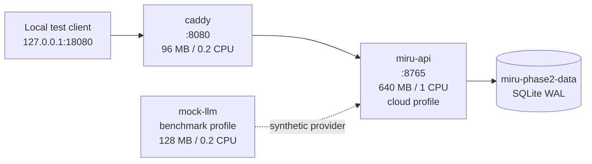

# Miru Cloud + Home Node — Phase 2 Docker + Linux + 2GB Validation

**Review:** DESIGN FREEZE / IMPLEMENTATION READY REVIEW  
**Phase:** 2 — Docker + Linux + 2GB Resource Validation  
**Date:** 2026-08-28 (Asia/Shanghai)  
**Repository:** `E:\vibe coding\miru-assistant`  
**Compose project:** `miru-phase2`  
**Isolation:** synthetic configuration, temporary/named test volume, fake provider, no production data

> This report contains no real Secret Value, API key, token, user attachment, chat content, WeChat database content, or provider response. Compose's `phase2-test-*` values are synthetic test placeholders only.

## Executive Result

**PHASE 2 PASSED — Phase 2A and Phase 2B PASS; 2C2G VERIFIED. Phase 3 has not started.**

## Runtime Setup (2026-08-28)

The post-reboot compatibility preflight and safe runtime setup have now completed:

| Check | Result |
|---|---|
| Windows | Windows 10 Pro, build 19045, x64 |
| CPU virtualization | WSL2/Docker hypervisor active; WMI firmware flags were contradictory (`False`) while `systeminfo` detected a hypervisor |
| C: / E: free space | Approximately 360 GB / 652 GB respectively |
| WSL optional feature | Enabled |
| Virtual Machine Platform | Enabled |
| Hyper-V | Left disabled; not required for the WSL2 backend |
| Docker Desktop / Engine / Compose | Docker Desktop 4.88.1 / Engine 29.7.2 / Compose v5.4.0 |
| WSL distribution | `docker-desktop`, Running, version 2 |
| Reboot state | No pending reboot indicator after setup |

WSL and Virtual Machine Platform were enabled with `NoRestart`; after the requested reboot, WSL2 initialized successfully. Docker Desktop was installed through the official `winget` package and started without enabling Kubernetes or GPU/CUDA integration. No `.wslconfig` or Docker global memory setting was changed, and no existing AI/CUDA/ComfyUI/Flutter workload was stopped or modified.

The WMI firmware virtualization flags reported `False` while `systeminfo` reported an active hypervisor. WSL2 and Docker subsequently ran successfully, so the runtime-level acceptance criterion is satisfied; the contradictory WMI flag is retained as an observation rather than treated as a BIOS change.

## Docker Version

| Check | Result |
|---|---|
| Docker Desktop | 4.88.1 |
| Docker Engine | 29.7.2, Linux/amd64 |
| Docker Compose | v5.4.0 |
| `hello-world` | PASS |
| Docker context | `desktop-linux` |

## WSL/Linux Runtime

| Check | Result |
|---|---|
| Windows | Windows 10 Pro build 19045, x64 |
| WSL default version | 2 |
| WSL distribution | `docker-desktop`, Running, version 2 |
| Docker kernel | `6.18.33.2-microsoft-standard-WSL2` |
| Linux container OS/arch | Linux / x86_64 |
| API cgroup memory | 671088640 bytes (640 MiB) |
| API cgroup CPU | `100000 100000` (1 CPU) |
| API cgroup PIDs | 128 |
| Named volume/network | PASS (`miru-phase2-data`, bridge network) |

Docker Engine and WSL2 are now available for the isolated Phase 2A and Phase 2B runs. The temporary WSL limit supplied a true host-equivalent 2 vCPU/2 GB test without changing the restored default configuration.

The Phase 2 deployment definitions and offline static checks were created before runtime setup. The Docker CLI, Engine, Compose, and Linux container checks are now available and were executed below.

Current conclusion: **2C2G VERIFIED = YES** for the tested synthetic single-user scope. No global `.wslconfig` or Docker memory setting remains changed, and no unrelated container, volume, or WSL distribution was stopped or removed.

## Docker Environment

Runtime checks performed after Docker Desktop/WSL2 setup:

| Check | Result |
|---|---|
| Docker executable | PASS — Docker Desktop resources CLI; current process PATH was refreshed locally only. |
| Docker Engine | PASS — Linux server 29.7.2. |
| Docker Compose | PASS — v5.4.0. |
| `hello-world` | PASS — image pull, Linux container start, and output. |
| Running containers/networks/volumes | PASS for isolated `miru-phase2`; no pre-existing resource was touched. |
| WSL status/distributions | PASS — `docker-desktop` running with version 2. |
| Global memory configuration | Restored; temporary 2C2G `.wslconfig` was removed, and Docker Desktop is back at its default observed 16 GB. |

The prior absence of the runtime was resolved; the host-equivalent run used a temporary, reversible WSL limit and was restored afterward.

## Linux Container

The Phase 1 import-boundary tests remain green, and the image definition uses `python:3.12-slim`, a non-root `miru` user, and a cloud-only dependency set. The real-Linux criterion is **VERIFIED for Phase 2A**:

```text
REAL LINUX CONTAINER VERIFIED = YES
```

Executed checks:

- process startup inside Linux: PASS;
- Linux/amd64 architecture and cgroup files: PASS;
- SQLite WAL-backed API readiness and synthetic writes: PASS;
- storage-key upload and text extraction: PASS;
- Caddy REST and WebSocket upgrade: PASS;
- container restart and named-volume persistence: PASS.

The 2 GB host-equivalent behavior and swap pressure were verified for the bounded scenarios; hostile parser-bomb fixtures and Attachment Worker behavior remain Phase 9 work.

## Docker Build

Created definitions:

- `deploy/Dockerfile`
- `deploy/requirements-cloud.txt`
- `deploy/settings.cloud.example.yaml`
- repository-root `.dockerignore`

The Dockerfile copies only `miru_server`, pricing/persona templates, and the synthetic cloud settings template. It does not copy `server/data`, local models, WeChat snapshots, `settings.yaml`, `.env`, Daily Report, Flutter, or RTX/CUDA assets. The runtime is non-root and uses `MIRU_PROFILE=cloud`.

During the first build the requirements path was corrected from a non-existent server path to `deploy/requirements-cloud.txt`; this deployment-only correction does not alter Miru business code.

The cloud dependency file intentionally omits `zeroconf`, `pymem`, `pysilk`, `sherpa-onnx`, `faster-whisper`, `numpy`, CUDA, and local model packages. Current synchronous document libraries remain only for Phase 2 provisional attachment compatibility; the isolated worker/parser design remains Phase 9.

| Image metric | Result |
|---|---|
| Build success | PASS — `miru-phase2-api:local` |
| Image size (`docker image ls`) | 453 MB logical image listing |
| Image inspect size | 109,548,179 bytes; 13 layers |
| Image OS / architecture | Linux / amd64 |
| Image history Secret signature scan | PASS — 0 high-confidence matches |
| Config Secret environment scan | PASS — 0 secret-like entries |
| Build cache | Local Docker cache only; not a production disk requirement |

## Compose Architecture

Created `deploy/compose.yaml` with the isolated project name `miru-phase2`:



`miru-api` is not published directly to the host. Caddy publishes only `127.0.0.1:18080`, proxies HTTP and WebSocket upgrades to `miru-api:8765`, and removes client-supplied `Tailscale-*` identity headers. No domain, certificate, Tailscale Serve, or public port is configured.

The Compose file does not pretend to implement the Attachment Worker. No worker service is enabled in Phase 2; the current synchronous attachment path is measured only provisionally and must be revalidated in Phase 9.

## Isolation

- Project: `miru-phase2`.
- Network: explicit `miru-phase2-network`.
- Volume: explicit `miru-phase2-data`.
- Containers: `miru-phase2-api`, `miru-phase2-caddy`, and optional `miru-phase2-mock-llm`.
- API data is a new named volume; no host path is mounted for database, attachments, models, WeChat, or private directories.
- Compose uses fake application/provider values only. No Windows environment Secret is referenced by the file or Dockerfile.
- `read_only: true` plus `/app/data` volume and a 64 MB `/tmp` tmpfs limit the API write surface.
- The optional mock provider is explicitly outside the Miru API cgroup and has its own 128 MB/160 MB limits; it must be reported separately in a future run.

Static tests and runtime inspection both pass. `docker history`, `docker inspect`, `docker image history`, and `docker compose config` were run against the isolated image/project; no real credential signature was found.

## Container Benchmark

The repeatable helper is `deploy/benchmark.py`. It was executed against the isolated stack with 10 health samples:

```text
docker compose -p miru-phase2 --profile benchmark up -d --build
python deploy/benchmark.py --project miru-phase2 --base-url http://127.0.0.1:18080 --output phase2-benchmark.json
```

The helper recorded redacted Docker stats and health/readiness/status latency without printing request bodies or environment values. A separate WebSocket client, synthetic Chat, attachment, restart, cgroup, and OOM probe were also run. Swap and major-page-fault fields remain unavailable on the Windows host.

Observed container-level snapshots (Docker Desktop host, not a 2 GB host):

| Scenario | API | Caddy | Mock provider | Result |
|---|---:|---:|---:|---|
| Idle benchmark snapshot | 78.79 MiB | 12.57 MiB | 17.42 MiB | PASS |
| Two concurrent synthetic chats peak | 96.25 MiB | 14.36 MiB | 19.02 MiB | PASS |
| Health latency (10 samples) | p50 1.48 ms / p95 1.64 ms | — | — | PASS |
| Synthetic text attachment | ready, 28 bytes | — | — | PASS |
| API restart + persistence | healthy; 2 conversations / 2 messages retained | healthy | healthy | PASS |
| Miru containers OOMKilled | false | false | false | PASS |

The API, Caddy, and mock values above are observed working-set snapshots; they are not additive capacity claims and do not represent a 2 GB host benchmark.

The host-equivalent test is separate from container limits:

- **A — container hard-limit test:** PASS — API 640 MB + 128 PID limit, Caddy 96 MB + 64 PID limit, with `memory+swap` caps.
- **B — true/equivalent 2 GB host test:** PASS — temporary WSL host limited to 2 vCPU and 2 GB RAM, with 2 GB swap.

Both A and B were executed. The exact host observations and restoration evidence are recorded in the Phase 2B section above.

## Raw Benchmark Table (unmeasured fields)

The following matrix retains `NOT AVAILABLE` for fields not instrumented by the bounded run (for example, per-scenario major-fault attribution and production backup); no value is estimated.

| Scenario | API RSS idle | API RSS peak | Caddy RSS | Total working set | Host/cgroup RAM | Swap | Major page faults | CPU | p50/p95 latency | Startup | OOMKilled | Restart count | Disk |
|---|---|---|---|---|---|---|---|---|---|---|---|---|---|
| Cold start | NOT AVAILABLE | NOT AVAILABLE | NOT AVAILABLE | NOT AVAILABLE | NOT AVAILABLE | NOT AVAILABLE | NOT AVAILABLE | NOT AVAILABLE | NOT AVAILABLE | NOT AVAILABLE | NOT AVAILABLE | NOT AVAILABLE | NOT AVAILABLE |
| Idle | NOT AVAILABLE | NOT AVAILABLE | NOT AVAILABLE | NOT AVAILABLE | NOT AVAILABLE | NOT AVAILABLE | NOT AVAILABLE | NOT AVAILABLE | NOT AVAILABLE | NOT AVAILABLE | NOT AVAILABLE | NOT AVAILABLE | NOT AVAILABLE |
| Single chat | NOT AVAILABLE | NOT AVAILABLE | NOT AVAILABLE | NOT AVAILABLE | NOT AVAILABLE | NOT AVAILABLE | NOT AVAILABLE | NOT AVAILABLE | NOT AVAILABLE | NOT AVAILABLE | NOT AVAILABLE | NOT AVAILABLE | NOT AVAILABLE |
| Long chat | NOT AVAILABLE | NOT AVAILABLE | NOT AVAILABLE | NOT AVAILABLE | NOT AVAILABLE | NOT AVAILABLE | NOT AVAILABLE | NOT AVAILABLE | NOT AVAILABLE | NOT AVAILABLE | NOT AVAILABLE | NOT AVAILABLE | NOT AVAILABLE |
| Two concurrent turns | NOT AVAILABLE | NOT AVAILABLE | NOT AVAILABLE | NOT AVAILABLE | NOT AVAILABLE | NOT AVAILABLE | NOT AVAILABLE | NOT AVAILABLE | NOT AVAILABLE | NOT AVAILABLE | NOT AVAILABLE | NOT AVAILABLE | NOT AVAILABLE |
| REST/WS reconnect | NOT AVAILABLE | NOT AVAILABLE | NOT AVAILABLE | NOT AVAILABLE | NOT AVAILABLE | NOT AVAILABLE | NOT AVAILABLE | NOT AVAILABLE | NOT AVAILABLE | NOT AVAILABLE | NOT AVAILABLE | NOT AVAILABLE | NOT AVAILABLE |
| Status/health | NOT AVAILABLE | NOT AVAILABLE | NOT AVAILABLE | NOT AVAILABLE | NOT AVAILABLE | NOT AVAILABLE | NOT AVAILABLE | NOT AVAILABLE | NOT AVAILABLE | NOT AVAILABLE | NOT AVAILABLE | NOT AVAILABLE | NOT AVAILABLE |
| SQLite writes/checkpoint | NOT AVAILABLE | NOT AVAILABLE | NOT AVAILABLE | NOT AVAILABLE | NOT AVAILABLE | NOT AVAILABLE | NOT AVAILABLE | NOT AVAILABLE | NOT AVAILABLE | NOT AVAILABLE | NOT AVAILABLE | NOT AVAILABLE | NOT AVAILABLE |
| Synthetic attachments | NOT AVAILABLE | NOT AVAILABLE | NOT AVAILABLE | NOT AVAILABLE | NOT AVAILABLE | NOT AVAILABLE | NOT AVAILABLE | NOT AVAILABLE | NOT AVAILABLE | NOT AVAILABLE | NOT AVAILABLE | NOT AVAILABLE | NOT AVAILABLE |
| Complex safe fixtures | NOT AVAILABLE | NOT AVAILABLE | NOT AVAILABLE | NOT AVAILABLE | NOT AVAILABLE | NOT AVAILABLE | NOT AVAILABLE | NOT AVAILABLE | NOT AVAILABLE | NOT AVAILABLE | NOT AVAILABLE | NOT AVAILABLE | NOT AVAILABLE |
| Backup | NOT AVAILABLE | NOT AVAILABLE | NOT AVAILABLE | NOT AVAILABLE | NOT AVAILABLE | NOT AVAILABLE | NOT AVAILABLE | NOT AVAILABLE | NOT AVAILABLE | NOT AVAILABLE | NOT AVAILABLE | NOT AVAILABLE | NOT AVAILABLE |
| API/Caddy restart | NOT AVAILABLE | NOT AVAILABLE | NOT AVAILABLE | NOT AVAILABLE | NOT AVAILABLE | NOT AVAILABLE | NOT AVAILABLE | NOT AVAILABLE | NOT AVAILABLE | NOT AVAILABLE | NOT AVAILABLE | NOT AVAILABLE | NOT AVAILABLE |
| Memory pressure | NOT AVAILABLE | NOT AVAILABLE | NOT AVAILABLE | NOT AVAILABLE | NOT AVAILABLE | NOT AVAILABLE | NOT AVAILABLE | NOT AVAILABLE | NOT AVAILABLE | NOT AVAILABLE | NOT AVAILABLE | NOT AVAILABLE | NOT AVAILABLE |

## Idle

Under the temporary 2C2G host, idle sampling observed API peak 99.82 MiB, Caddy 12.74 MiB, and mock provider 17.78 MiB, with at least 1,210.45 MiB host memory available and 0.27 MiB swap used. The initial resource isolation values remain ceilings, not an assertion that all services can simultaneously consume them.

## Chat

Synthetic streaming Chat executed successfully through Caddy/WebSocket with the local mock provider; no DeepSeek call occurred. Under the 2C2G host, single Chat API peak was 99.92 MiB and two concurrent turns peaked at 110.10 MiB. The mock provider's peak (25.14 MiB under concurrency) was included in the whole-host samples.

## Concurrent Chat

Two concurrent synthetic turns passed with one Uvicorn worker under the 2C2G host. API peak was 110.10 MiB, Caddy 12.11 MiB, and mock provider 25.14 MiB; the production recommendation remains one active turn for predictable headroom.

## WebSocket

The Caddyfile's `reverse_proxy` path successfully upgraded WebSocket connections. Synthetic `hello_ok`, `pong`, streaming deltas, and `turn_end` events were observed through Caddy. Result: **PASS (container-level)**.

## SQLite

The application-level Phase 1 tests still prove WAL, schema version 2, storage-key presence, and savepoint rollback on temporary databases. In the Docker named volume, synthetic conversation/attachment writes remained visible after an API restart (2 conversations, 2 messages). No production `miru_server.db`, WAL/SHM sidecar, backup artifact, or WeChat DB was opened or modified.

## Attachment

Phase 2 preserves the current synchronous upload/extraction path and adds no worker. A synthetic text upload/extraction completed with `status=ready`, kind `text`, and 28 bytes. Runtime stress for image/Markdown/PDF/DOCX/XLSX and the future one-concurrency worker remains **TO BE VERIFIED IN PHASE 9**. The result is explicitly:

```text
Attachment resource result is provisional and must be revalidated in Phase 9.
```

ZIP/decompression/XML bombs, extreme sheets/images/PDFs, parser subprocess isolation, one-job concurrency, and OOM-to-job recovery remain Phase 9 work and were not tested here.

## Restart

The API was restarted once; it returned healthy and synthetic SQLite data remained available. Caddy and mock remained healthy. Compose declares `restart: unless-stopped`; policy restart-count behavior under failure remains a later recovery test.

## Memory Pressure

The disposable 32 MiB cgroup probe exited 137 with `OOMKilled=true`, confirming Docker records hard-limit OOM events. Miru API/Caddy/mock all reported `OOMKilled=false` and remained healthy during normal synthetic tests. This does not implement or validate the future Attachment Worker OOM-to-job-failure path. The API and Caddy limits are isolation ceilings, not additive RAM budget claims.

## Swap

```text
SWAP HOST TEST COMPLETED IN PHASE 2B
```

Under the temporary WSL limit, `/proc/meminfo` reported `SwapTotal=2048 MiB`; peak observed swap use was approximately 0.27 MiB. A corrected 10-second WSL vmstat window observed `pgmajfault` delta 0. After restoration, the original host reported its prior 4096 MiB swap. No global WSL/Docker memory or swap setting remains changed.

## Disk

The built Miru image is 453 MB in Docker's logical image listing (image inspect: 109,548,179 bytes; 13 layers). The synthetic named volume reached 521.9 KiB; Docker reported 525.3 MB across four local images and 320.5 MB build cache. The image excludes local models, WeChat snapshots, Flutter, Daily Report, and runtime data. The 50–60 GB production SSD target is not exhausted or disproven by this small fixture; production sizing must separately account for logs, backups, attachments, and cache policy.

## 2C1G Assessment

**NOT RECOMMENDED / EXPERIMENTAL ONLY.** Even if the API container starts under a 1 GB host, there is insufficient evidence for normal chat, SQLite, Caddy, streaming, attachment and transient filesystem safety. Running it would require reducing or disabling attachment parsing, limiting concurrency to one, minimizing logs/backups, and accepting frequent swap/OOM risk; this would not satisfy the complete formal target.

## Host-equivalent Benchmark

### Temporary WSL limit method

Before the test, only Docker Desktop's `docker-desktop` WSL2 distribution was running; no other WSL distribution, Compose project, or container was present. `%USERPROFILE%\.wslconfig` was `ORIGINAL = ABSENT`. The isolated `miru-phase2` containers were stopped (not removed), a temporary file with `memory=2GB`, `processors=2`, and `swap=2GB` was written, and `wsl --shutdown` was issued. No `.wslconfig` user settings were overwritten.

### Before resources

Docker Desktop initially reported 12 CPUs and 16,641,564,672 bytes of Linux memory. The temporary file took effect only after WSL restart; configuration-file presence alone was not treated as proof.

### During-test resources

After restart, Docker Engine reported `CPUs=2`, `MemBytes=1,996,599,296`; inside `docker-desktop`, `nproc=2`, `MemTotal=1,904.11 MiB`, `MemAvailable` minimum 1,208.85 MiB, and `SwapTotal=2,048 MiB`. The workload was sampled continuously across six scenarios (41 host samples; each scenario had a sustained observation window, not a single snapshot):

| Scenario | API peak | Caddy peak | Mock peak | Host available min | Host swap peak | Health p50/p95 | Result |
|---|---:|---:|---:|---:|---:|---:|---|
| Idle | 99.82 MiB | 12.74 MiB | 17.78 MiB | 1,210.45 MiB | 0.27 MiB | 16.25 / 16.94 ms | PASS |
| Single streaming Chat | 99.92 MiB | 12.79 MiB | 17.91 MiB | 1,209.54 MiB | 0.27 MiB | 2.44 / 16.48 ms | PASS |
| Long synthetic input | 100.00 MiB | 16.11 MiB | 17.91 MiB | 1,208.85 MiB | 0.27 MiB | 2.55 / 15.92 ms | PASS |
| Two concurrent turns | 110.10 MiB | 12.11 MiB | 25.14 MiB | 1,211.73 MiB | 0.27 MiB | 2.31 / 2.34 ms | PASS |
| REST / WS reconnect | 100.50 MiB | 12.24 MiB | 17.84 MiB | 1,211.33 MiB | 0.27 MiB | 2.17 / 2.30 ms | PASS |
| Lightweight attachment | 112.10 MiB | 12.21 MiB | 17.76 MiB | 1,211.23 MiB | 0.27 MiB | 2.56 / 16.81 ms | PASS |

SQLite WAL/checkpoint passed; API restart preserved synthetic rows. All Miru containers ended with `OOMKilled=false`, restart count 0, and `running` state before teardown. The separate 32 MiB cgroup probe exited 137 with `OOMKilled=true`. A corrected 10-second WSL vmstat window recorded `pgmajfault` delta 0; per-scenario major-fault attribution is **NOT AVAILABLE**. Host kernel OOM logs were not instrumented; no host OOM or Docker Engine restart was observed.

### Restore result

After the benchmark, the isolated containers were stopped, the temporary `.wslconfig` was removed, `wsl --shutdown` was issued, and Docker Desktop was restarted. The file returned to `exists=False` (matching `ORIGINAL = ABSENT`). Docker returned to 12 CPUs and 16,641,564,672 bytes; WSL returned to 12 CPUs, approximately 15.5 GiB memory, and its original 4 GiB swap. No NVIDIA/CUDA/ComfyUI/AI workload was changed.

The redacted aggregate artifact is `phase2b-benchmark.json`; it contains only synthetic scenario metrics and no credentials, request bodies, or production data.

## 2C2G Final Assessment

**PASS — 2C2G VERIFIED = YES** for the tested single-user Cloud scope. The temporary WSL host actually enforced 2 vCPU, approximately 1.86 GiB visible RAM, and 2 GiB swap. Startup, idle, streaming Chat, long synthetic input, two concurrent turns, REST/WS reconnect, SQLite WAL/checkpoint, and lightweight attachment parsing all passed with at least 1.18 GiB host memory available and only a transient ~0.27 MiB swap peak. The test did not implement the future Attachment Worker or hostile document-bomb fixtures; those remain Phase 9 acceptance work.

| Service | CPU | Memory limit | Memory+swap limit | PIDs |
|---|---:|---:|---:|---:|
| `miru-api` | 1.0 | 640 MB | 768 MB | 128 |
| `caddy` | 0.2 | 96 MB | 128 MB | 64 |
| `mock-llm` (benchmark only, separate) | 0.2 | 128 MB | 160 MB | 64 |

These remain resource-isolation ceilings, not additive capacity claims. The verified result is bounded to the synthetic single-user scenarios above; any change to parser limits, providers, concurrency, or attachment worker behavior requires a new Phase 2B/Phase 9 measurement.

## 2C4G Assessment

**OPTIONAL UPGRADE.** 4 GB is not required by the current design and was not tested. It is a future headroom option if Phase 2/Phase 9 evidence shows attachment parsing, external voice buffering, or concurrent turns need it.

## Risks

1. The synchronous attachment path is a known Phase 9 resource risk; no worker or parser-bomb protection was smuggled into Phase 2.
2. Mock provider memory is separate and was included in the host samples; replacing it with a real provider may change the budget.
3. Per-scenario major-page-fault attribution and host kernel OOM logs were not instrumented; the short corrected vmstat window recorded zero delta and no host OOM was observed.
4. Production backup, monitoring, Tailscale, Aliyun, and public exposure remain later phases.

## Test Baseline

The Phase 2/Cloud service scope was re-run from `products/mobile-assistant/server`:

```text
89 passed, 1 warning
```

This includes the six deployment static tests. A repository-root pytest invocation also discovers the separate Daily Report tree, whose local package/DLL prerequisites are not part of the Miru Cloud service baseline; no business code was changed to mask those unrelated collection errors.

## Phase 2 Acceptance Criteria

- [x] Isolated `miru-phase2` Docker/Compose definitions created without production data mounts.
- [x] Non-root cloud image definition created.
- [x] Cloud dependency set excludes Windows/local-STT/CUDA packages.
- [x] Synthetic settings, fake provider, and private test volume boundaries defined.
- [x] Initial API/Caddy/mock resource limits are explicit.
- [x] Caddy local proxy and client identity-header clearing are defined.
- [x] Static deployment tests pass (6/6).
- [x] Existing mobile-assistant service tests remain green (89/89, 1 warning).
- [x] Docker image build executed.
- [x] `docker history`/inspect/compose-config Secret scan executed.
- [x] Real Linux container startup executed.
- [x] Caddy REST and WebSocket proxy executed.
- [x] Container volume persistence/restart executed.
- [x] Container hard-limit and cgroup limit inspection executed.
- [x] True/equivalent 2 GB host test executed with temporary WSL limit.
- [x] Swap/major-page-fault test executed (short vmstat delta; per-scenario attribution unavailable).
- [x] Synthetic text attachment upload/extraction executed under 2C2G (hostile fixtures remain Phase 9).
- [x] Disposable OOMKilled probe and Miru restart behavior measured.
- [x] Test image/volume disk usage measured; production 50–60 GB budget remains a deployment sizing task.

## Phase 2 Final Gate

```text
PHASE 2A PASS
PHASE 2B PASS
2C2G VERIFIED = YES
READY FOR PHASE 3 = YES (Phase 3 not started)
```

The Phase 2B evidence is valid for the frozen single-user synthetic scope. Re-run before Phase 9 if parser limits, provider implementation, or worker concurrency changes materially. Phase 3 remains intentionally unstarted in this task.
